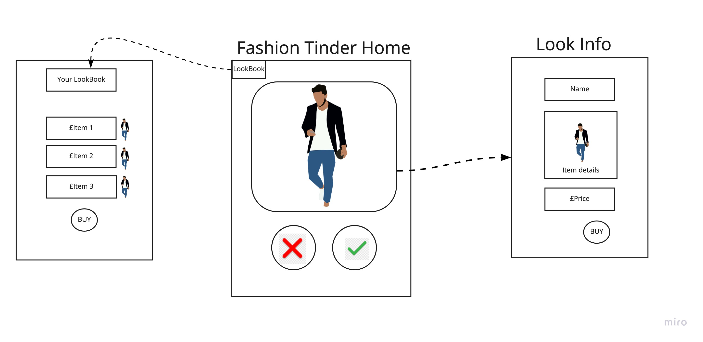

<h1 align="center">Fashion Finder</h1>

Fashion Finder is the final project of Team RTFD,M (Read the Frackin' Docs, Man) from the January 2019 cohort of Makers Academy.<br />
The team created a beautiful, simple-to-use and responsive application in React.JS to assist designers with showcasing their fashion lines & styles. The approach for the project is as follows:
- Objective: Create an ecommerce app with Tinder-like functionality to see and be inspired by fashion looks, allowing a user to "purchase" the look(s) they want through a payment gateway.
- Code ownership across the team throughout the project.
- Become thoroughly familiar with React and Firebase.
- Maintain best Agile Practices throughout the project.

<p align="center"><a href="https://fashion-finder-prod.firebaseapp.com/">Visit Fashion Finder</a></p>

[](https://codeclimate.com/github/rtfdm/fashion-finder/maintainability) [](https://codeclimate.com/github/rtfdm/fashion-finder/test_coverage) [](https://travis-ci.com/rtfdm/fashion-finder)
<br />
[](https://forthebadge.com)

## Getting Started

Clone repository: ` git clone git@github.com:rtfdm/fashion-finder.git`.
Install dependencies: `npm install`

Create a [Firebase](https://firebase.google.com) database to serve your content, and another one for your test database. On our project, these were called `fashion-finder-prod` and `fashion-finder-test`. The wiki above has more information about the data structure of the database if you want to model your own.

You will need to input environment variables into your `.env` file based on your Firebase configuration. Again, the wiki above has more information. We suggest using `source .env` to make sure the configurations get loaded into your profile.

### Development

Throughout our development of Fashion Finder, we used ESLint to make sure our code conformed to standard. You can run `eslint src/`. You may need to run `npm i eslint-plugin-react@latest --save-dev` or `npm i -g eslint-plugin-react@latest` first to make sure you have the React plugin installed. (The latter command installs the package globally).

#### Serving

[Parcel](https://parceljs.org/) is being used as a bundler.

Use `npm run start` to start the development server. Then visit `localhost:1234` to view the development website.

Hot reloading is enabled.

#### Testing

[Jest](https://parceljs.org/) and [React Testing Library](https://github.com/kentcdodds/react-testing-library) are being using for unit testing.

Use `npm run test` to run the test suite.

[Cypress](https://www.cypress.io/) is used for feature testing.

Use `npm run cypress:open` to run the feature test suite.

All the test suites run in our [CI environment](https://travis-ci.com/rtfdm/fashion-finder) as well.

#### Building

User `npm run build` to build the application. This outputs a `./dist` folder, which isn't version controlled. However, the build script is required for Continuous Integration and Continuous Deployment (using [Travis](https://travis-ci.org/)).

#### Deployment

`master` is automatically deployed to [Firebase Hosting](https://firebase.google.com/docs/hosting/) using Travis CI. To manually deploy a branch, you will need `firebase-tools`:

```
npm install -g firebase-tools
```

Once installed, login and deploy:
```
firebase login #enter details
firebase deploy #deploys checkedout branch
```
#### App Wireframe Overview 


